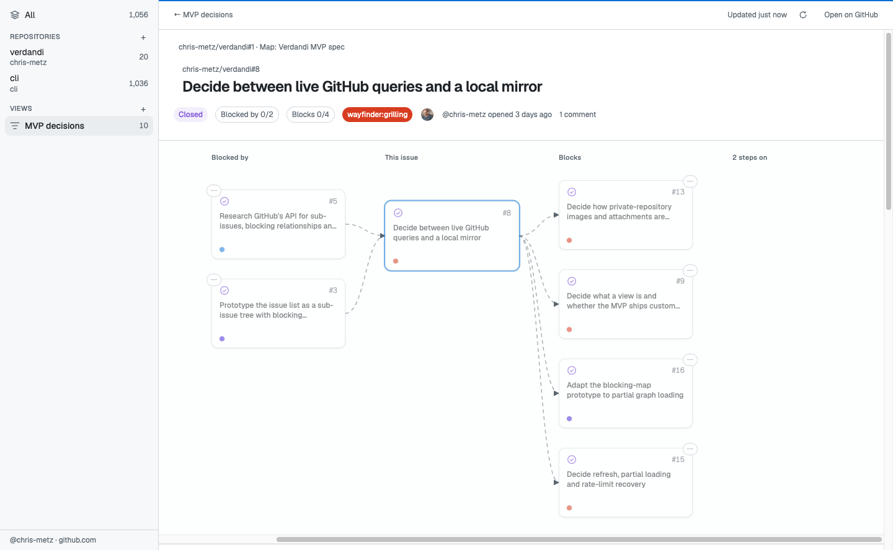
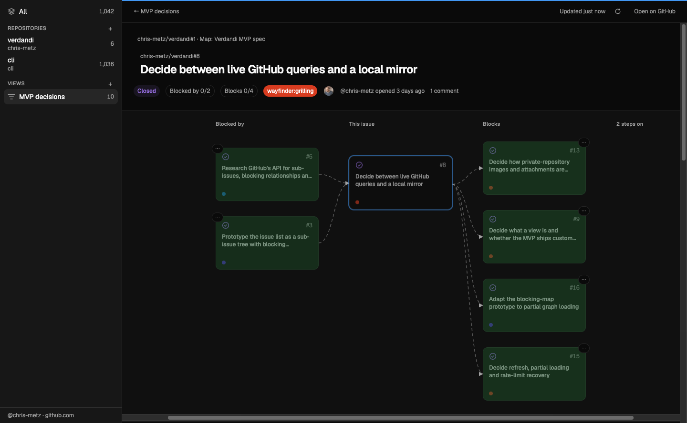

<p align="center"></p>

<h1 align="center">Verdandi</h1>

A keyboard-first desktop client for GitHub issues across many repositories, focused on how issues relate: sub-issue hierarchies and blocking relationships that cross repository boundaries. Vocabulary is in [`CONTEXT.md`](CONTEXT.md), decisions in [`docs/adr/`](docs/adr/).

<p align="center">
  
  
</p>

## Prerequisites

- [Node.js](https://nodejs.org/) and [pnpm](https://pnpm.io/) in the versions pinned in `mise.toml`. Node stays on the major bundled with the Electron version in use.
- [GitHub CLI](https://cli.github.com/) (`gh`) 2.81.0 or later, signed in to github.com (`gh auth login`). Verdandi reads GitHub only through `gh` and never asks it for your token.

With [mise](https://mise.jdx.dev/), `mise install` sets up Node and pnpm.

## Run from source

```sh
pnpm install
pnpm dev
```

`pnpm dev` starts the desktop app. The first run downloads the Electron binary. The window reloads when the renderer changes, and the app restarts when the main process or preload changes.

Set `VERDANDI_HOME` to keep all of Verdandi's files under one directory, e.g. for a throwaway profile.

## Build a local app

```sh
pnpm package
```

It builds an unsigned app for the operating system you run it on, in `apps/desktop/dist/`, which starts by double-click:

- macOS: `mac-arm64/Verdandi.app` (`mac/Verdandi.app` on Intel). Drag it to Applications if you like. It is unsigned, meant for the Mac that built it.
- Windows: `win-unpacked/Verdandi.exe`.
- Linux: `linux-unpacked/verdandi`.

There are no installers, signing or updates yet. The first build downloads Electron. On macOS, packaging needs [Xcode](https://developer.apple.com/xcode/) 26 or later, which compiles the app icon; `pnpm dev` does not.

## App icon

The icon is drawn in `apps/desktop/build/icon.svg`. `apps/desktop/build/icon.icon` is the same drawing split into layers, in the format of Apple's Icon Composer, so that macOS renders its depth and its dark and tinted appearances; open it with Icon Composer, which comes with Xcode. After changing the drawing, change both, then run

```sh
pnpm icons
```

to render `apps/desktop/build/icon.png` (Linux, Windows, `pnpm dev` and this README) and `docs/social-preview.png` again, and commit them. The social preview is uploaded by hand, under the repository's Settings → General → Social preview.

## GitHub CLI

Verdandi looks for `gh` in this order:

1. where you chose it with **Choose gh executable…**, as long as it still works there;
2. on `PATH`;
3. where installers and package managers usually put it, such as `/opt/homebrew/bin` and `/usr/local/bin` on macOS, `/usr/bin`, `/home/linuxbrew/.linuxbrew/bin` and `/snap/bin` on Linux, and `C:\Program Files\GitHub CLI` on Windows.

The last step matters for an app started from Finder, the Start menu or a desktop entry: those don't pass on your shell's `PATH`. If Verdandi can't find `gh`, or `gh` isn't signed in, a setup dialog covers the app until it works, with **Check again** once you've fixed it in a terminal. Verdandi never installs `gh` or signs in for you. If `gh` works in your terminal but Verdandi doesn't find it, run `command -v gh` (`where.exe gh` on Windows) and choose that file. Verdandi remembers the choice on this machine only, in `state.json` in its machine-local folder (`~/Library/Application Support/Verdandi/desktop/` on macOS, `%LOCALAPPDATA%\Verdandi\desktop\` on Windows, `$XDG_STATE_HOME/verdandi/desktop/` on Linux, or `desktop/` under `VERDANDI_HOME`).

When `GH_TOKEN` or `GITHUB_TOKEN` is set where Verdandi starts, `gh` uses that token instead of the account it has stored, and the sidebar names the variable. Switching accounts with `gh auth switch` doesn't change that: change the variable and restart Verdandi.

## Track repositories

Until Verdandi can add repositories itself, list them by hand in `settings.json` in the user data directory: `~/Library/Application Support/Verdandi/` on macOS, `%APPDATA%\Verdandi\` on Windows, `$XDG_DATA_HOME/verdandi/` (by default `~/.local/share/verdandi/`) on Linux, or `VERDANDI_HOME` when it is set.

```json
{
  "version": 1,
  "repositories": [{ "name": "owner/repo" }],
  "views": []
}
```

The sidebar follows the file order. Drag an entry within its section, or press ⌥/Alt+↑/↓ on the selected entry, to reorder and save it. All stays first.

**File → Show Settings File** opens the folder. Hand edits appear live. Settings use strict JSON: unknown fields and invalid values are reported with their location. While the file is broken or unreadable, Verdandi keeps its last valid sidebar and disables changes. **Reload** checks again; **Reset** preserves the original as `settings.json.broken-<timestamp>` and starts empty.

Files from a newer version are read-only until Verdandi is updated. Older files are migrated on the next change, with a one-time `settings.json.backup-v<version>` backup.

## Choose the look

How Verdandi looks is kept in `config.toml` in the config directory: `~/.config/verdandi/` on macOS and Linux (`$XDG_CONFIG_HOME/verdandi/` when that is set), `%APPDATA%\Verdandi\` on Windows, or `VERDANDI_HOME` when it is set. It is meant for your dotfiles. Every key is optional:

```toml
appearance = "system"               # "system", "light" or "dark"
light_theme = "github-light"        # github-light
dark_theme = "github-dark-dimmed"   # github-dark or github-dark-dimmed
```

**Settings…** (⌘, on macOS, Ctrl+, elsewhere) picks the appearance and the themes, writing each change to the file at once: only that key changes, and your comments and formatting stay. Without a file, the first change creates it. **File → Show Config File** reveals it, or its folder while there is none. Changes by hand apply at once too. A value Verdandi cannot use falls back to its default, an unknown key is ignored, and a file that is not valid TOML means every default; the sidebar says what and where until the file is fixed.

## Check before pushing

```sh
pnpm check
```

It runs typecheck, lint, format check and tests. `pnpm format` fixes formatting.

## Layout

- `packages/core`: all domain behaviour, as plain TypeScript for Node. It never depends on Electron, React or the DOM, so a later terminal UI can reuse it.
- `apps/desktop`: the Electron app. The main process runs the core in-process and only wires it to IPC; preload exposes it to the React renderer, which reaches the core only through the typed contract in `packages/core/src/contract.ts`.
